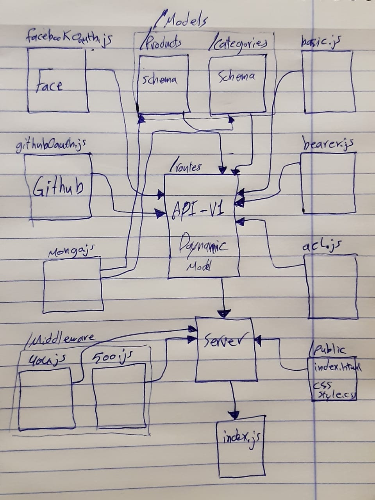

# authenticated-api-server

# LAB - Class 15

### Author: Ahmad Sawalqeh

### Links and Resources

- [submission PR](https://github.com/Ahmad-Sawalqeh/authenticated-api-server/pull/1)
- [ci/cd]() (GitHub Actions)

### Setup
run `npm i` to install the needed Dependencies `JEST, ESLINT, CORS, DOTENV, MORGAN, MONGOOSE, EXPRESS, superagent, @code-fellows/supergoose`. 
also you need `base-64`, `bcryptjs` and `jsonwwebtoken` for authentication/authorization sign-in by facebook and github accounts.

`.env` requirements (where applicable)

* `PORT` - 3000
* `MONGODB_URI` - 'mongodb://localhost:27017/class15'
* `SECRET` - `MYOWNSECRET`
* `FACE_TOKEN_URL` - 'https://graph.facebook.com/v6.0/oauth/access_token'
* `FACE_REMOTE_API` - 'https://graph.facebook.com/me'
* `GITHUB_TOKEN_URL` - 'https://github.com/login/oauth/access_token'
* `GITHUB_REMOTE_API` - 'https://api.github.com/user'
* `FACE_CLIENT_ID` - '520042838644247'
* `FACE_CLIENT_SECRET` - '672eea6cc59210a304c8239f1e6aa835'
* `FACE_API_SERVER` - 'http://localhost:3000/oauth'
* `GITHUB_CLIENT_ID` - '6adabe1798d74605bcd7'
* `GITHUB_CLIENT_SECRET` - '9cf2052a1defe82ad3b91f1c7e852343a2b91dfb'
* `GITHUB_API_SERVER ` - 'http://localhost:3000/githubOauth'

#### How to initialize/run your application (where applicable)
run `npm test` to check all test.

#### start

- How do you run the app? 
  run `npm start`

# UML

